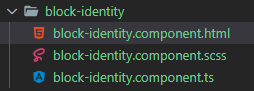
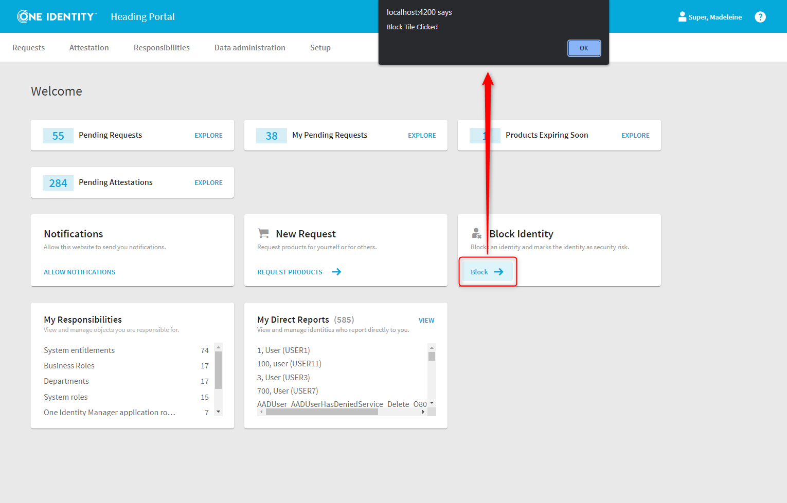

# Adding a tile component to the dashboard

The IMX Portal landing page consists of the IMX Dashboard component, which can be found in the QER library (projects\qer\src\lib\wport\start).

It is composed of 3 sections with different tiles.


Tiles can be added dynamically to the dashboard. The following example gives an overview of the different types of tiles and demonstrates how to add a new element - the blue bordered tile - to the dashboard.


## Dashboard tiles

The Tiles modules (projects\qbm\src\lib\tile) and (projects\qer\src\libtiles) offers  different base components :

- TileComponent (QBM)
- BadgeTileComponent (QER)
- IconTileComponent (QER)
- NotificationTileComponent (QER)


These components are variations of the same concept. In the further course we will implement a new tile based on the IconTileComponent.


## Implementing the "Block Identity" Tile

What is the fictitious but realistic scenario we will implement?
There is a security breach and an administrator wants to block the account of the affected identity. The implementation of this scenario will span several examples. Here we will first create the tile that can trigger that process.

### Creating the "Block Identity" Component

First we need to create the "Block Identity" component. We assume that the reader has a basic knowledge of the Angular framework and knows how to create components, services, etc.

The component consists of 3 files, but we will not pay further attention to the stylesheet.



### The anatomy of the "Block Identity" component

Basically, the component consists of 2 parts, a Typescript file and the corresponding HTML template.


The HTML template is based on the previously mentioned IconTileComponent component.

> Code

``` html
<imx-icon-tile caption="Block Identity" image="userremove" [subtitle]="description">
  <ng-template #ActionTemplate>
    <button mat-button color="primary" (click)="block()">
      <span>{{ '#LDS#Block' | translate }}</span>
      &nbsp;
      <eui-icon size="m" icon="forward"></eui-icon>
    </button>
  </ng-template>
</imx-icon-tile>
```

The IconTileComponent expects some input fields like "caption", "image" or "subtitle". Which tiles components expect which inputs can be found in the Tiles Module.

> NOTE

> IMX components and applications are based on the One Identity Elemental UI framework, which in turn extends Angular Material.  The "eui-icon" tag is such an Elemental UI component (https://elemental.dev.oneidentity.com/)

The corresponding *.ts component is not very exciting. On the one hand it sets the "Description" property/input used in the template and implements the (dummy) "block()" method.

> Code
``` ts
import { Component } from '@angular/core';

@Component({
  selector: 'imx-block-identity',
  templateUrl: './block-identity.component.html',
  styleUrls: ['./block-identity.component.scss']
})
export class BlockIdentityComponent  {
  public description = 'Blocks an identity and marks the identity as security risk.';

  constructor() { }

  public block(): void {
    alert('Block Tile Clicked');
  }

}
```

That's all we need at this time for the "Block Identity" component.

## Wiring it up
The next step is to include the component into the dashboard.
To do this, we must make it available to the web application, in this case the portal.
This is done in the init service of the corresponding module (don't worry, there will be more samples on the topic).

Here is the relevant section of the service.

> Code

``` ts
@Injectable({ providedIn: 'root' })
export class InitService {
  public onInit(routes: Route[]): void {
    this.extService.register('Dashboard-MediumTiles', {
      instance: BlockIdentityComponent,
    });
  }
}
```

The final result looks like this.





