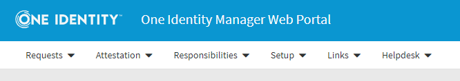

# Adding a menu to the Portal

In the previous example, we added a tile component to the dashboard to block a user's account.

In this example, we want to add a new item to the portal main menu to achieve the same functionality.

The main menu (projects\qbm\src\lib\menu) is a central component, just like the dashboard.



New menus and menu items are dynamically added to the main menu via a plugin system.

Before we implement the menu, we have to add a route that navigates to the (currently empty) component where you can select the identity you want to block.

We will name the new component SelectIdentityComponent.


First we add a new entry to the routing table.

> Code

``` ts
const routes: Routes = [
  :
  {
    path: 'selectidentity',
    component: SelectIdentityComponent
  }
];
```

Now we can add the new menu with the associated route. Again, as in the previous example, this is done in the init service (init-service.ts). In the code snippet below, only the part where the menu is added is shown, the rest is hidden.

> Code

``` ts
:

@Injectable({ providedIn: 'root' })
export class InitService {
  :
  
  public onInit(routes: Route[]): void {
    this.addRoutes(routes);
    :
  }

  private addRoutes(routes: Route[]): void {
    const config = this.router.config;
    routes.forEach((route) => {
      config.unshift(route);
    });
    this.router.resetConfig(config);
  }

  private setupMenu(): void {
    this.menuService.addMenuFactories(
      :
      (preProps: string[], __: string[]) => {
        return {
          id: 'ROOT_SAMPLES',
          title: '#LDS#Samples'
          items: [
            {
              id: 'SAMPLE_SELECT_IDENTITY',
              route: 'selectidentity',
              title: '#LDS#Select Identity'
            },
          ],
        };
    );
  }
}
```

You can add menues and menu items via the menu service (projects\qbm\src\lib\menu). The structure of the menu and the menu items is defined by the menu-item.interface.ts file. The most important properties are "id" and "title". If you add a menu item, the "route" property  specifies the route of the component to be displayed.

Here is an extract of the file.

> Code

``` ts
import { ProjectConfig } from 'imx-api-qbm';
import { NavigationCommandsMenuItem } from './navigation-commands-menu-item.interface';

/** Represents a single menu item. */
export interface MenuItem {
  /** Unique identifier for the menu item. */
  readonly id?: string;

  /** Display name. */
  readonly title: string;

  /** Returns a descriptive text, intended for tooltips. */
  readonly description?: string;

  /** Property for simple navigation. */
  readonly route?: string;

  /** Property for sorting the items. */
  readonly sorting?: string;

  /** Property for complex navigation, including outlets etc. */
  navigationCommands?: NavigationCommandsMenuItem;

  /** Called when the menu item is clicked. */
  readonly trigger?: () => void;

  /** Submenu items. */
  items?: MenuItem[];

}

export type MenuFactory = (preProps: string[], groups: string[], projectConfig: ProjectConfig) => MenuItem;

```

The final result looks like this.

