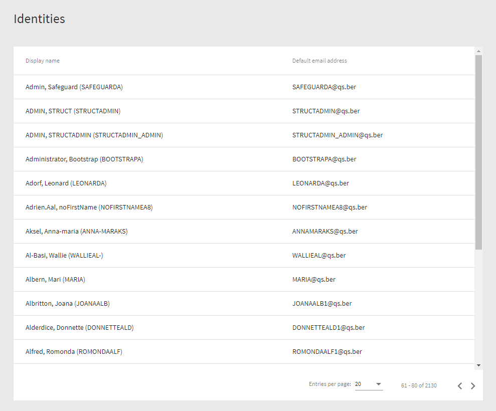
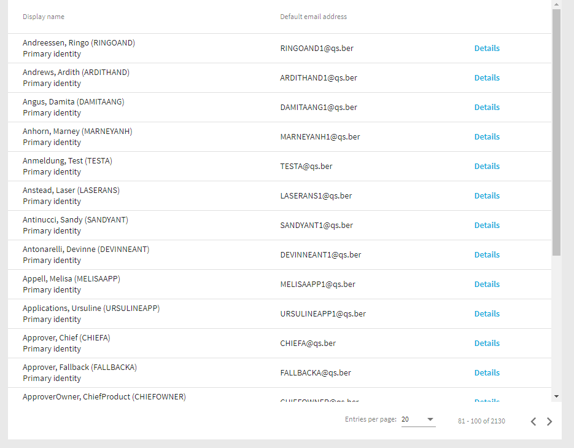
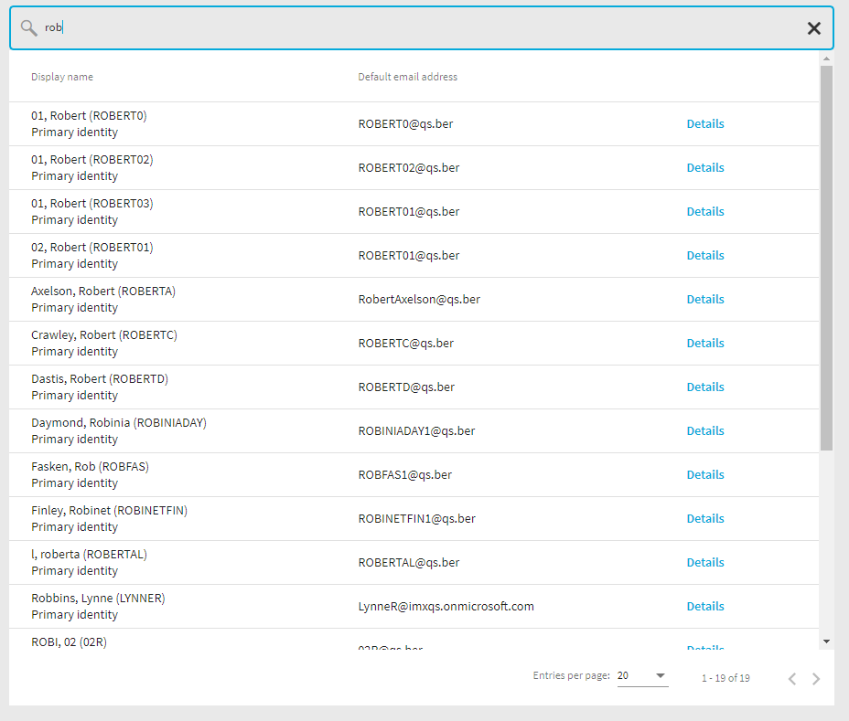

# Working with data tables

A frequently recurring task is the representation of data in tables. The IMX QBM library offers components that facilitate the visualization of data and take the special IMX data structure into account.

Data tables offer a lot of configuration possibilities. We will present the most important ones in this sample.

The two most important modules in this context are "data-source-toolbar" (projects\qbm\src\lib\data-source-toolbar) and "data-table" (projects\qbm\src\lib\data-table).

The basic structure consists of 3 elements, the data source toolbar, the actual table and a paginator.


In addition to the ability to search, filter, etc, the Data Source Toolbar contains a Data Source component that is used by the Data Table and the Paginator to display data and move within the data set. Think of the DST (Data Source Tool Bar) as a link between the Data Table and the Paginator.


The "Hello World" version of the Data Table component looks like as follow.

> Code
``` html
<h1 class="mat-headline">{{ '#LDS#Identities' | translate }}</h1>

<imx-data-source-toolbar
  #dst
  [settings]="dstSettings"
  (navigationStateChanged)="onNavigationStateChanged($event)"
></imx-data-source-toolbar>

<imx-data-table
  [dst]="dst"
  mode="auto"
>
</imx-data-table>

<imx-data-source-paginator [dst]="dst"></imx-data-source-paginator>
```

> Code 
``` ts

@Component({
  selector: 'imx-select-identity',
  templateUrl: './select-identity.component.html',
  styleUrls: ['./select-identity.component.scss'],
})
export class SelectIdentityComponent implements OnInit {
  public dstSettings: DataSourceToolbarSettings;
  public readonly schema: EntitySchema;
  public readonly DisplayColumns = DisplayColumns;
  public navigationState: CollectionLoadParameters = { PageSize: 20 };

  private displayedColumns: IClientProperty[] = [];

  constructor(private readonly qerApiClient: QerApiService) {
    this.schema = this.qerApiClient.typedClient.PortalPersonAll.GetSchema();
    this.displayedColumns = [
      this.schema.Columns[DisplayColumns.DISPLAY_PROPERTYNAME],
      this.schema.Columns.DefaultEmailAddress
    ];
  }

  public async ngOnInit(): Promise<void> {
    await this.navigate();
  }

  public async onNavigationStateChanged(newState?: CollectionLoadParameters): Promise<void> {
    if (newState) {
      this.navigationState = newState;
    }
    await this.navigate();
  }

  private async navigate(): Promise<void> {
    const data = await this.qerApiClient.typedClient.PortalPersonAll.Get(this.navigationState);

    this.dstSettings = {
      displayedColumns: this.displayedColumns,
      dataSource: data,
      entitySchema: this.schema,
      navigationState: this.navigationState,
    };
  }
}

```

The minimum set of properties that must be set are "EntitySchema", "DisplayColumns" and "CollectionLoadParameters". 

Three places in the .ts Datei are worth to be highlighted.

> Code
``` ts
 this.displayedColumns = [
      this.schema.Columns[DisplayColumns.DISPLAY_PROPERTYNAME],
      this.schema.Columns.DefaultEmailAddress
    ];
```

"displayedColumns" defines which columns the table should display.

> Code
``` ts
  public async onNavigationStateChanged(newState?: CollectionLoadParameters): Promise<void> {
    if (newState) {
      this.navigationState = newState;
    }
    await this.navigate();
  }
```

This event handler is called every time the state of the data changes, e.g. when the user navigates to the next page.

> Code
``` ts
 private async navigate(): Promise<void> {
    const data = await this.qerApiClient.typedClient.PortalPersonAll.Get(this.navigationState);

    this.dstSettings = {
      displayedColumns: this.displayedColumns,
      dataSource: data,
      entitySchema: this.schema,
      navigationState: this.navigationState,
    };
  }
```
The "navigate()" method retrievs data from the API server. The actual request is made by calling the API client ("this.qerApiClient.typedClient.PortalPersonAll.Get(this.navigationState)"). The concept of API clients is described in a separate sample.

The first version of the Component looks like this.



## Designing the table

The table above shows two fields that are rendered automatically. It is also possible to design columns manually. Whether the table is rendered automatically or manually is controlled by the "mode" input field.

> Code
``` html
<imx-data-table
  [dst]="dst"
  mode="auto"
>
</imx-data-table>
```

"mode" can take two values: "auto" and "manual". 

To display the previous table in manual mode, we need to add the two columns to the html template.

> Code
``` html
<imx-data-table [dst]="dst" mode="manual">
  <imx-data-table-column [entityColumn]="schema?.Columns[DisplayColumns.DISPLAY_PROPERTYNAME]">
    <ng-template let-item>
      <div>{{ item.GetEntity().GetDisplay() }}</div>
    </ng-template>
  </imx-data-table-column>
  <imx-data-table-column [entityColumn]="schema?.Columns.DefaultEmailAddress">
    <ng-template let-item>
      <div>{{ item.DefaultEmailAddress.Column.GetDisplayValue() }}</div>
    </ng-template>
  </imx-data-table-column>
</imx-data-table>
```
In the next step we will add a new column to the table containing a button and slightly modify the first column.

The first column currently shows the default display of the object. We want to add a second row that indicates whether the person is a primary identity or not.

> Code
``` html
<imx-data-table [dst]="dst" mode="manual">
  <imx-data-table-column [entityColumn]="schema?.Columns[DisplayColumns.DISPLAY_PROPERTYNAME]">
    <ng-template let-item>
      <div>{{ item.GetEntity().GetDisplay() }}</div>
      <div>{{ item.IdentityType.Column.GetDisplayValue() }}</div>
    </ng-template>
  </imx-data-table-column>
  <imx-data-table-column [entityColumn]="schema?.Columns.DefaultEmailAddress">
    <ng-template let-item>
      <div>{{ item.DefaultEmailAddress.Column.GetDisplayValue() }}</div>
    </ng-template>
  </imx-data-table-column>
</imx-data-table>
```

Next we will add a third column that will contain a button. To display data of an object the table uses the "<imx-data-table-column>" tag. To display other types of elements, such as buttons, we use the "<imx-data-table-generic-column>" tag.
Before we can display the button, we need to add the new synthetic column to the columns to be displayed. This is done in the *.ts file.

> Code
``` ts
 this.displayedColumns = [
      this.schema.Columns[DisplayColumns.DISPLAY_PROPERTYNAME],
      this.schema.Columns.DefaultEmailAddress,
      {
        ColumnName: 'viewDetailsButton',
        Type: ValType.String
      }
    ];
```


> Code
``` html
<imx-data-table [dst]="dst" mode="manual">
  <imx-data-table-column [entityColumn]="schema?.Columns[DisplayColumns.DISPLAY_PROPERTYNAME]">
    <ng-template let-item>
      <div>{{ item.GetEntity().GetDisplay() }}</div>
      <div>{{ item.IdentityType.Column.GetDisplayValue() }}</div>
    </ng-template>
  </imx-data-table-column>
  <imx-data-table-column [entityColumn]="schema?.Columns.DefaultEmailAddress">
    <ng-template let-item>
      <div>{{ item.DefaultEmailAddress.Column.GetDisplayValue() }}</div>
    </ng-template>
  </imx-data-table-column>
  <imx-data-table-generic-column columnName="viewDetailsButton">
    <ng-template>
      <button mat-button color="primary">
        {{ '#LDS#Details' | translate }}
      </button>
    </ng-template>
  </imx-data-table-generic-column>
</imx-data-table>
```

The extended component now looks like this.



## Adding search

Enabling search is pretty straightforward. 
To do this, you must first enable the "search" option and secondly implement a method that processes the output of the "search" output parameter. 

The following code snippets shows these changes.

> Code
``` html
<imx-data-source-toolbar
  #dst
  [settings]="dstSettings"
  (navigationStateChanged)="onNavigationStateChanged($event)"
  [options]="['search']"
  (search)="onSearch($event)"
></imx-data-source-toolbar>
```

> Code
``` ts
  public async onSearch(keywords: string): Promise<void> {
    this.navigationState.StartIndex = 0;
    this.navigationState.search = keywords;
    await this.navigate();
  }
```





